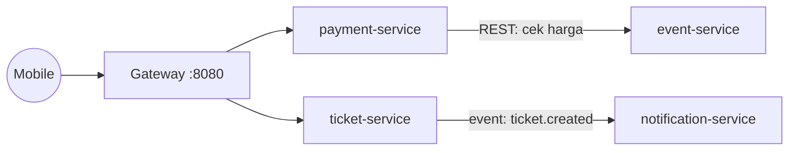

# API Squad — War Tiket Konser (Kelompok13)

Kontrak API Microservices untuk tema **War Tiket Konser**.
Repositori ini adalah artefak **Arsitek Sistem** — sumber kebenaran tunggal bentuk API squad.

---

## Context Map



> Panah penuh = REST sinkron (penerima harus hidup).
> Panah berlabel `event:` = event asinkron (boleh diproses nanti).

---

## Services

| Service | Port | Tanggung Jawab | Pemilik Data |
|---|---|---|---|
| `event-service` | 3001 | Kelola data konser & venue | `events` |
| `ticket-service` | 3002 | Kelola & kunci kursi | **`kursi`** ← sumber daya rebutan |
| `payment-service` | 3003 | Proses pembayaran tiket | `payments` |
| `notification-service` | 3004 | Kirim notifikasi email/push | — |

Aturan emas: **satu layanan memiliki datanya sendiri.** Layanan lain memanggil API-nya, bukan membaca database-nya.

---

## Kontrak API

| File | Versi | Status |
|---|---|---|
| [`openapi.yaml`](./openapi.yaml) | 1.0.0 | Development — boleh berubah |
| [`openapi-final.yaml`](./openapi-final.yaml) | 2.0.0 | **DIBEKUKAN** — hanya aditif |

Cara memastikan benar: tempel ke [editor.swagger.io](https://editor.swagger.io) — panel kanan tidak boleh merah.

### Endpoint Kritis

| Endpoint | Pemilik | Keterangan |
|---|---|---|
| `GET /events` | event-service | Daftar konser berpaginasi |
| `POST /events/{id}/lock` | ticket-service | Kunci kursi (409 jika habis) |
| `POST /payments` | payment-service | Bayar pesanan tiket |
| `GET /tickets` | ticket-service | Daftar tiket pengguna |

---

## ADR (Architecture Decision Records)

Setiap keputusan besar squad dicatat di [`docs/adr/`](./docs/adr/).

| ADR | Keputusan |
|---|---|
| [ADR-001](./docs/adr/ADR-001.md) | Semua endpoint daftar wajib paginasi `page`/`limit` |
| [ADR-002](./docs/adr/ADR-002.md) | Kontrak API dibekukan di v2.0.0 |

---

## Menjalankan Semua Service

```bash
docker compose up --build
```

Gateway tersedia di `http://localhost:8080`.
