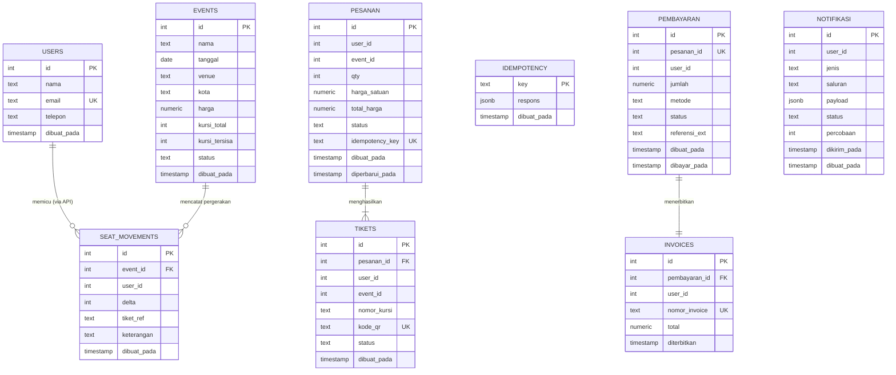

# ERD — War Tiket Konser (Kelompok 13)

> **Pola: Database-per-Service**  
> Satu instance PostgreSQL, empat basis data logis yang terpisah.  
> Komunikasi antar layanan **hanya lewat HTTP/API**, tidak ada JOIN lintas database.  
> Kolom `user_id`, `event_id`, `pesanan_id` di luar database asal adalah **referensi logis** (bukan FK fisik).

---

## Diagram ERD (Mermaid)



---

## Ringkasan Tabel per Layanan

| Layanan | Database | Tabel | Keterangan |
|---|---|---|---|
| `event-service` | `event_db` | `users` | Pengguna terdaftar (sumber kebenaran data user) |
| `event-service` | `event_db` | `events` | Data konser — `kursi_tersisa` dijaga atomik via `UPDATE ... WHERE` |
| `event-service` | `event_db` | `seat_movements` | Riwayat pergerakan kursi (audit trail) |
| `ticket-service` | `ticket_db` | `pesanan` | Pesanan tiket — status: `menunggu_pembayaran → dibayar` |
| `ticket-service` | `ticket_db` | `tikets` | Tiket individual per kursi — berisi `kode_qr` untuk scan masuk |
| `ticket-service` | `ticket_db` | `idempotency` | Cache respons — kiriman ulang mobile aman |
| `payment-service` | `payment_db` | `pembayaran` | Transaksi pembayaran — satu pesanan satu pembayaran |
| `payment-service` | `payment_db` | `invoices` | Bukti bayar yang dikirim ke email pengguna |
| `notification-service` | `notification_db` | `notifikasi` | Log semua notif (email/push/sms) dengan status & retry |

---

## Alur Lengkap: Beli Tiket Konser

```
Pengguna                 event-service        ticket-service       payment-service      notification-service
    |                         |                     |                    |                      |
    |── GET /events ─────────>|                     |                    |                      |
    |   (cek daftar konser)   |── SELECT events ──> DB(event_db)         |                      |
    |<─ { data, page, total } |                     |                    |                      |
    |                         |                     |                    |                      |
    |── POST /events/:id/lock ──────────────────────>|                   |                      |
    |   { qty, Idempotency-Key }                     |                   |                      |
    |                         |                     |── UPDATE events    |                      |
    |                         |                     |   SET kursi_tersisa = kursi_tersisa - qty  |
    |                         |                     |   WHERE id=$1 AND kursi_tersisa >= qty     |
    |                         |                     |   RETURNING ...    |                      |
    |                         |              [409 jika stok habis]       |                      |
    |                         |                     |── INSERT pesanan ──> DB(ticket_db)         |
    |                         |                     |── INSERT idempotency                       |
    |<─ 201 { pesananId, tiketId, total } ──────────|                   |                      |
    |                         |                     |                    |                      |
    |── POST /payments ─────────────────────────────────────────────────>|                     |
    |   { pesananId, metode }                                            |                      |
    |                         |                     |                    |── INSERT pembayaran   |
    |                         |                     |<── PATCH /pesanan/:id/status (dibayar)    |
    |                         |                     |   UPDATE pesanan SET status='dibayar'      |
    |                         |                     |── INSERT tikets (generate kode_qr)         |
    |                         |                     |                    |── INSERT invoices     |
    |                         |                     |                    |                      |
    |                         |                     |                    |── POST /notifications >|
    |                         |                     |                    |  { jenis: 'pembayaran_berhasil' }
    |                         |                     |                    |                      |── INSERT notifikasi
    |<─ 201 { invoiceId, dibayarPada, kodeQR } ─────────────────────────|                      |
    |                         |                     |                    |                      |
    |── GET /tickets?user_id=x ──────────────────────>                  |                      |
    |<─ { data: [{ kode_qr, event, venue, tanggal }], ... }             |                      |
```

---

## Keputusan Kritis Data & Persistence

### Lapisan 1 — Satu Basis Data per Layanan
- **Alasan:** Layanan bisa deploy, scale, dan gagal secara independen. Skema `ticket_db` bisa berubah tanpa menyentuh `event_db`.
- **Konsekuensi:** Tidak ada FK fisik lintas DB. Konsistensi dijaga lewat API + event (eventual consistency untuk notifikasi).

### Lapisan 2 — Scalable: Jaga Sumber Daya Rebutan

| Sumber Daya | Penjaga | Teknik |
|---|---|---|
| `events.kursi_tersisa` | `event_db` | `UPDATE ... WHERE kursi_tersisa >= qty RETURNING` — atomik satu langkah |
| Stok Redis | Redis | Lua script `DECRBY` atomik — tolak `-2` jika tidak cukup |
| Cache daftar event | Redis TTL 30s | Cache-aside di `GET /events` |

- **CHECK constraint** `kursi_tersisa >= 0` sebagai jaring pengaman terakhir di DB.
- **FOR UPDATE** (dalam transaksi) dipakai jika perlu logika bertingkat sebelum mengurangi.

### Lapisan 3 — Mobile: Data Jujur di Jaringan Buruk
- **Keyset pagination** (`WHERE id > $after`) lebih stabil dari OFFSET saat ada insert baru.
- **Idempotency-Key** di `pesanan.idempotency_key UNIQUE` — dua POST dengan key sama menghasilkan satu baris.
- **Format respons konsisten** `{ data, page, limit, total }` — kontrak tidak berubah antar versi API.
- **Kolom baru lewat migrasi ADD COLUMN** — tidak pernah menghapus/mengganti kolom yang sudah ada.

---

## Indeks Kunci

| Tabel | Indeks | Jenis | Untuk Query |
|---|---|---|---|
| `events` | `idx_events_tanggal` | BTREE | `ORDER BY tanggal DESC` di halaman daftar |
| `events` | `idx_events_status` | BTREE | filter `WHERE status = 'aktif'` |
| `seat_movements` | `idx_movements_event_time` | BTREE komposit | `WHERE event_id = $1 ORDER BY dibuat_pada DESC` |
| `pesanan` | `idx_pesanan_user` | BTREE | riwayat pesanan per pengguna |
| `tikets` | `idx_tikets_kode_qr` | BTREE partial | scan masuk venue `WHERE kode_qr = $1` |
| `notifikasi` | `idx_notif_status` | BTREE partial | retry worker `WHERE status IN ('antrian','gagal')` |
